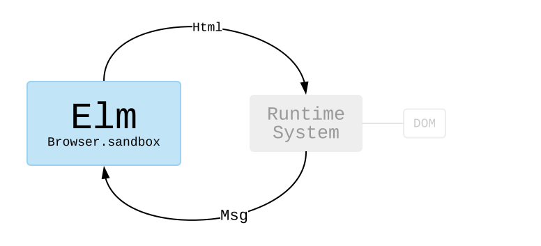

# Commands and Subscriptions

Earlier in this book we saw The Elm Architecture handle mouse and keyboard interactions, but what about talking to servers? Generating random numbers?

To answer these questions, it helps to learn more about how The Elm Architecture works behind the scenes. This will explain why things work a bit differently than in languages like JavaScript, Python, etc.


## `sandbox`

I have not made a big deal about it, but so far all of our programs were created with [`Browser.sandbox`][sandbox]. We gave an initial `Model` and describe how to `update` and `view` it.

You can think of `Browser.sandbox` as setting up a system like this:



We get to stay in the world of Elm, writing functions and transforming data. This hooks up to Elm&rsquo;s **runtime system**. The runtime system figures out how to render `Html` efficiently. Did anything change? What is the minimal DOM modification needed? It also figures out when someone clicks a button or types into a text field. It turns that into a `Msg` and feeds it into your Elm code.

By cleanly separating out all the DOM manipulation, it becomes possible to use extremely aggressive optimizations. So Elm&rsquo;s runtime system is a big part of why Elm is [one of the fastest options available][benchmark].

[sandbox]: https://package.elm-lang.org/packages/elm/browser/latest/Browser#sandbox
[benchmark]: https://elm-lang.org/blog/blazing-fast-html-round-two


## `element`

In the next few examples, we are going to use [`Browser.element`][element] to create programs. This will introduce the ideas of **commands** and **subscriptions** which allow us to interact with the outside world.

You can think of `Browser.element` as setting up a system like this:


In addition to producing `Html` values, our programs will also send `Cmd` and `Sub` values to the runtime system. In this world, our programs can **command** the runtime system to make an HTTP request or to generate a random number. They can also **subscribe** to the current time.

I think commands and subscriptions make more sense when you start seeing examples, so let&rsquo;s do that!

[element]: https://package.elm-lang.org/packages/elm/browser/latest/Browser#element


> **Note 1:** Some readers may be worrying about asset size. &ldquo;A runtime system? That sounds big!&rdquo; It is not! In fact, Elm assets are [exceptionally small](https://elm-lang.org/blog/small-assets-without-the-headache) when compared to popular alternatives.
>
> **Note 2:** We are going to use packages from [`package.elm-lang.org`](https://package.elm-lang.org) in the upcoming examples. We have already been working with a couple:
>
> - [`elm/core`](https://package.elm-lang.org/packages/elm/core/latest/)
> - [`elm/html`](https://package.elm-lang.org/packages/elm/html/latest/)
>
> But now we will start getting into some fancier ones:
>
> - [`elm/http`](https://package.elm-lang.org/packages/elm/http/latest/)
> - [`elm/json`](https://package.elm-lang.org/packages/elm/json/latest/)
> - [`elm/random`](https://package.elm-lang.org/packages/elm/random/latest/)
> - [`elm/time`](https://package.elm-lang.org/packages/elm/time/latest/)
>
> There are tons of other packages on `package.elm-lang.org` though! So when you are making your own Elm programs locally, it will probably involve running some commands like this in the terminal:
>
>```bash
elm init
elm install elm/http
elm install elm/random
```
>
> That would set up an `elm.json` file with `elm/http` and `elm/random` as dependencies.
>
> I will be mentioning the packages we are using in the following examples, so I hope this gives some context on what that is all about!
