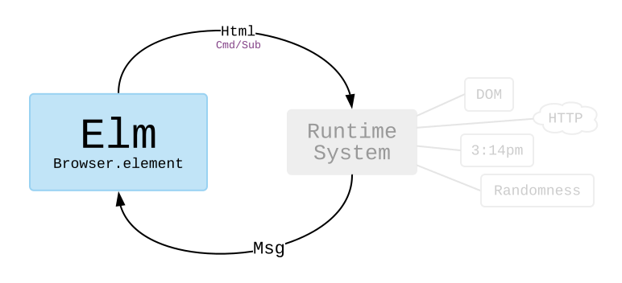

# HTTP

---
#### [Clone the code](https://github.com/evancz/elm-architecture-tutorial/) or follow along in the [online editor](https://elm-lang.org/examples/book).
---

It is often helpful to grab information from elsewhere on the internet.

For example, say we want to load the full text of _Public Opinion_ by Walter Lippmann. Published in 1922, this book provides a historical perspective on the rise of mass media and its implications for democracy. For our purposes here, we will focus on how to use the [`elm/http`][http] package to get this book into our app!

Let&rsquo;s start by just looking at all the code. There are some new things, but do not worry. We will go through it all!

[http]: https://package.elm-lang.org/packages/elm/http/latest

```elm
import Browser
import Html exposing (Html, text, pre)
import Http


-- MAIN


main =
  Browser.element
    { init = init
    , update = update
    , subscriptions = subscriptions
    , view = view
    }


-- MODEL


type Model
  = Failure
  | Loading
  | Success String


init : () -> (Model, Cmd Msg)
init _ =
  ( Loading
  , Http.get
      { url = "https://elm-lang.org/assets/public-opinion.txt"
      , expect = Http.expectString GotText
      }
  )


-- UPDATE


type Msg
  = GotText (Result Http.Error String)


update : Msg -> Model -> (Model, Cmd Msg)
update msg model =
  case msg of
    GotText result ->
      case result of
        Ok fullText ->
          (Success fullText, Cmd.none)

        Err _ ->
          (Failure, Cmd.none)


-- SUBSCRIPTIONS


subscriptions : Model -> Sub Msg
subscriptions model =
  Sub.none


-- VIEW


view : Model -> Html Msg
view model =
  case model of
    Failure ->
      text "I was unable to load your book."

    Loading ->
      text "Loading..."

    Success fullText ->
      pre [] [ text fullText ]
```

Some parts of this should be familiar from previous examples of The Elm Architecture. We still have a `Model` of our application. We still have an `update` that reacts to messages. We still have a `view` function that shows everything on screen.

The new parts extend the core pattern we saw before with some changes in `init` and `update`, and the addition of `subscription`.


## `init`

The `init` function describes how to initialize our program:

```elm
init : () -> (Model, Cmd Msg)
init _ =
  ( Loading
  , Http.get
      { url = "https://elm-lang.org/assets/public-opinion.txt"
      , expect = Http.expectString GotText
      }
  )
```

Like always, we have to produce the initial `Model`, but now we are also producing some **command** of what we want to do immediately. That command will eventually produce a `Msg` that gets fed into the `update` function.

Our book website starts in the `Loading` state, and we want to GET the full text of our book. When making a GET request with [`Http.get`][get], we specify the `url` of the data we want to fetch, and we specify what we `expect` that data to be. So in our case, the `url` is pointing at some data on the Elm website, and we `expect` it to be a big `String` we can show on screen.

The `Http.expectString GotText` line is saying a bit more than that we `expect` a `String` though. It is also saying that when we get a response, it should be turned into a `GotText` message:

```elm
type Msg
  = GotText (Result Http.Error String)

-- GotText (Ok "The Project Gutenberg EBook of ...")
-- GotText (Err Http.NetworkError)
-- GotText (Err (Http.BadStatus 404))
```

Notice that we are using the `Result` type from a couple sections back. This allows us to fully account for the possible failures in our `update` function. Speaking of `update` functions...

[get]: https://package.elm-lang.org/packages/elm/http/latest/Http#get

> **Note:** If you are wondering why `init` is a function (and why we are ignoring the argument) we will talk about it in the upcoming chapter on JavaScript interop! (Preview: the argument lets us get information from JS on initialization.)


## `update`

Our `update` function is returning a bit more information as well:

```elm
update : Msg -> Model -> (Model, Cmd Msg)
update msg model =
  case msg of
    GotText result ->
      case result of
        Ok fullText ->
          (Success fullText, Cmd.none)

        Err _ ->
          (Failure, Cmd.none)
```

Looking at the type signature, we see that we are not just returning an updated model. We are _also_ producing a **command** of what we want Elm to do.

Moving on to the implementation, we pattern match on messages like normal. When a `GotText` message comes in, we inspect the `Result` of our HTTP request and update our model depending on whether it was a success or failure. The new part is that we also provide a command.

So in the case that we got the full text successfully, we say `Cmd.none` to indicate that there is no more work to do. We already got the full text!

And in the case that there was some error, we also say `Cmd.none` and just give up. The text of the book did not load. If we wanted to get fancier, we could pattern match on the [`Http.Error`][Error] and retry the request if we got a timeout or something.

The point here is that however we decide to update our model, we are also free to issue new commands. I need more data! I want a random number! Etc.

[Error]: https://package.elm-lang.org/packages/elm/http/latest/Http#Error


## `subscription`

The other new thing in this program is the `subscription` function. It lets you look at the `Model` and decide if you want to subscribe to certain information. In our example, we say `Sub.none` to indicate that we do not need to subscribe to anything, but we will soon see an example of a clock where we want to subscribe to the current time!


## Summary

When we create a program with `Browser.element`, we set up a system like this:



We get the ability to issue **commands** from `init` and `update`. This allows us to do things like make HTTP requests whenever we want. We also get the ability to **subscribe** to interesting information. (We will see an example of subscriptions later!)
