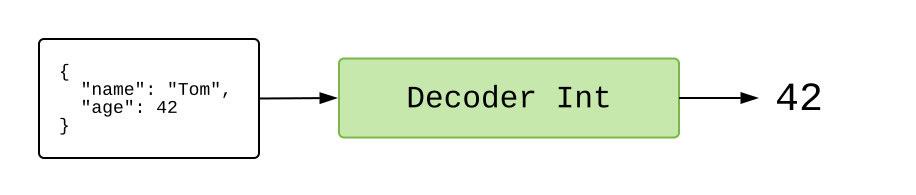
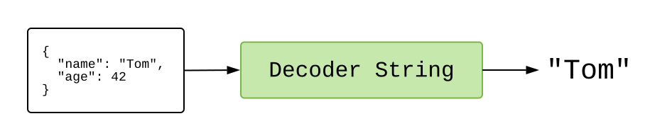

# JSON

---
#### [Clone the code](https://github.com/evancz/elm-architecture-tutorial/) or follow along in the [online editor](https://elm-lang.org/examples/cat-gifs).
---

We just saw an example that uses HTTP to get the content of a book. That is great, but a ton of servers return data in a special format called JavaScript Object Notation, or JSON for short.

So our next example shows how to fetch some JSON data, allowing us to press a button to show random cat GIFs.


```elm
import Browser
import Html exposing (..)
import Html.Attributes exposing (..)
import Html.Events exposing (..)
import Http
import Json.Decode exposing (Decoder, field, string)


-- MAIN


main =
  Browser.element
    { init = init
    , update = update
    , subscriptions = subscriptions
    , view = view
    }


-- MODEL


type Model
  = Failure
  | Loading
  | Success String


init : () -> (Model, Cmd Msg)
init _ =
  (Loading, getRandomCatGif)


-- UPDATE


type Msg
  = MorePlease
  | GotGif (Result Http.Error String)


update : Msg -> Model -> (Model, Cmd Msg)
update msg model =
  case msg of
    MorePlease ->
      (Loading, getRandomCatGif)

    GotGif result ->
      case result of
        Ok url ->
          (Success url, Cmd.none)

        Err _ ->
          (Failure, Cmd.none)


-- SUBSCRIPTIONS


subscriptions : Model -> Sub Msg
subscriptions model =
  Sub.none


-- VIEW


view : Model -> Html Msg
view model =
  div []
    [ h2 [] [ text "Random Cats" ]
    , viewGif model
    ]


viewGif : Model -> Html Msg
viewGif model =
  case model of
    Failure ->
      div []
        [ text "I could not load a random cat for some reason. "
        , button [ onClick MorePlease ] [ text "Try Again!" ]
        ]

    Loading ->
      text "Loading..."

    Success url ->
      div []
        [ button [ onClick MorePlease, style "display" "block" ] [ text "More Please!" ]
        , img [ src url ] []
        ]


-- HTTP


getRandomCatGif : Cmd Msg
getRandomCatGif =
  Http.get
    { url = "https://api.giphy.com/v1/gifs/random?api_key=dc6zaTOxFJmzC&tag=cat"
    , expect = Http.expectJson GotGif gifDecoder
    }


gifDecoder : Decoder String
gifDecoder =
  field "data" (field "image_url" string)
```

This example is pretty similar to the last one:

- `init` starts us off in the `Loading` state, with a command to get a random cat GIF.
- `update` handles the `GotGif` message for whenever a new GIF is available. Whatever happens there, we do not have any additional commands. It also handles the `MorePlease` message when someone presses the button, issuing a command to get more random cats.
- `view` shows you the cats!

The main difference is in the `getRandomCatGif` definition. Instead of using `Http.expectString`, we have switched to `Http.expectJson`. What is the deal with that?


## JSON

When you ask [`api.giphy.com`](https://api.giphy.com/v1/gifs/random?api_key=dc6zaTOxFJmzC&tag=cat) for a random cat GIF, their server produces a big string of JSON like this:

```json
{
  "data": {
    "type": "gif",
    "id": "l2JhxfHWMBWuDMIpi",
    "title": "cat love GIF by The Secret Life Of Pets",
    "image_url": "https://media1.giphy.com/media/l2JhxfHWMBWuDMIpi/giphy.gif",
    "caption": "",
    ...
  },
  "meta": {
    "status": 200,
    "msg": "OK",
    "response_id": "5b105e44316d3571456c18b3"
  }
}
```

We have no guarantees about any of the information here. The server can change the names of fields, and the fields may have different types in different situations. It is a wild world!

In JavaScript, the approach is to just turn JSON into JavaScript objects and hope nothing goes wrong. But if there is some typo or unexpected data, you get a runtime exception somewhere in your code. Was the code wrong? Was the data wrong? It is time to start digging around to find out!

In Elm, we validate the JSON before it comes into our program. So if the data has an unexpected structure, we learn about it immediately. There is no way for bad data to sneak through and cause a runtime exception three files over. This is accomplished with JSON decoders.


## JSON Decoders

Say we have some JSON:

```json
{
	"name": "Tom",
	"age": 42
}
```

We need to run it through a `Decoder` to access specific information. So if we wanted to get the `"age"`, we would run the JSON through a `Decoder Int` that describes exactly how to access that information:



If all goes well, we get an `Int` on the other side! And if we wanted the `"name"` we would run the JSON through a `Decoder String` that describes exactly how to access it:



If all goes well, we get a `String` on the other side!

How do we create decoders like this though?


## Building Blocks

The [`elm/json`][json] package gives us the [`Json.Decode`][decode] module. It is filled with tiny decoders that we can snap together.

[json]: https://package.elm-lang.org/packages/elm/json/latest/
[decode]: https://package.elm-lang.org/packages/elm/json/latest/Json-Decode

So to get `"age"` from `{ "name": "Tom", "age": 42 }` we would create a decoder like this:

```elm
import Json.Decode exposing (Decoder, field, int)

ageDecoder : Decoder Int
ageDecoder =
  field "age" int

 -- int : Decoder Int
 -- field : String -> Decoder a -> Decoder a
```

The [`field`][field] function takes two arguments:

1. `String` &mdash; a field name. So we are demanding an object with an `"age"` field.
2. `Decoder a` &mdash; a decoder to try next. So if the `"age"` field exists, we will try this decoder on the value there.

So putting it together, `field "age" int` is asking for an `"age"` field, and if it exists, it runs the `Decoder Int` to try to extract an integer.

We do pretty much exactly the same thing to extract the `"name"` field:

```elm
import Json.Decode exposing (Decoder, field, string)

nameDecoder : Decoder String
nameDecoder =
  field "name" string

-- string : Decoder String
```

In this case we demand an object with a `"name"` field, and if it exists, we want the value there to be a `String`.

[field]: https://package.elm-lang.org/packages/elm/json/latest/Json-Decode#field


## Nesting Decoders

Remember the `api.giphy.com` data?

```json
{
  "data": {
    "type": "gif",
    "id": "l2JhxfHWMBWuDMIpi",
    "title": "cat love GIF by The Secret Life Of Pets",
    "image_url": "https://media1.giphy.com/media/l2JhxfHWMBWuDMIpi/giphy.gif",
    "caption": "",
    ...
  },
  "meta": {
    "status": 200,
    "msg": "OK",
    "response_id": "5b105e44316d3571456c18b3"
  }
}
```

We wanted to access `response.data.image_url` to show a random GIF. Well, we have the tools now!

```elm
import Json.Decode exposing (Decoder, field, string)

gifDecoder : Decoder String
gifDecoder =
  field "data" (field "image_url" string)
```

This is the exact `gifDecoder` definition we used in our example program above! Is there a `"data"` field? Does that value have an `"image_url"` field? Is the value there a string? All our expectations are written out explicitly, allowing us to safely extract Elm values from JSON.


## Combining Decoders

That is all we needed for our HTTP example, but decoders can do more! For example, what if we want _two_ fields? We snap decoders together with [`map2`](https://package.elm-lang.org/packages/elm/json/latest/Json-Decode#map2):

```elm
map2 : (a -> b -> value) -> Decoder a -> Decoder b -> Decoder value
```

This function takes in two decoders. It tries them both and combines their results. So now we can put together two different decoders:

```elm
import Json.Decode exposing (Decoder, map2, field, string, int)

type alias Person =
  { name : String
  , age : Int
  }

personDecoder : Decoder Person
personDecoder =
  map2 Person
  	(field "name" string)
  	(field "age" int)
```

So if we used `personDecoder` on `{ "name": "Tom", "age": 42 }` we would get out an Elm value like `Person "Tom" 42`.

If we really wanted to get into the spirit of decoders, we would define `personDecoder` as `map2 Person nameDecoder ageDecoder` using our previous definitions. You always want to be building your decoders up from smaller building blocks!


## Next Steps

There are a bunch of important functions in `Json.Decode` that we did not cover here:

- [`bool`](https://package.elm-lang.org/packages/elm/json/latest/Json-Decode#bool) : `Decoder Bool`
- [`list`](https://package.elm-lang.org/packages/elm/json/latest/Json-Decode#list) : `Decoder a -> Decoder (List a)`
- [`dict`](https://package.elm-lang.org/packages/elm/json/latest/Json-Decode#dict) : `Decoder a -> Decoder (Dict String a)`
- [`oneOf`](https://package.elm-lang.org/packages/elm/json/latest/Json-Decode#oneOf) : `List (Decoder a) -> Decoder a`

So there are ways to extract all sorts of data structures. The `oneOf` function is particularly helpful for messy JSON. (e.g. sometimes you get an `Int` and other times you get a `String` containing digits. So annoying!)

There are also [`map3`](https://package.elm-lang.org/packages/elm/json/latest/Json-Decode#map3), [`map4`](https://package.elm-lang.org/packages/elm/json/latest/Json-Decode#map4), and others for handling objects with more than two fields. But as you start working with larger JSON objects, it is worth checking out [`NoRedInk/elm-json-decode-pipeline`](https://package.elm-lang.org/packages/NoRedInk/elm-json-decode-pipeline/latest). The types there are a bit fancier, but some folks find them much easier to read and work with.


> **Fun Fact:** I have heard a bunch of stories of folks finding bugs in their _server_ code as they switched from JS to Elm. The decoders people write end up working as a validation phase, catching weird stuff in JSON values. So when NoRedInk switched from React to Elm, it revealed a couple bugs in their Ruby code!
