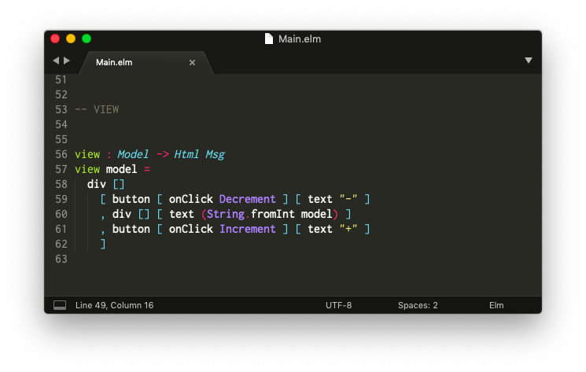

# Install a Code Editor

The first step is to get a code editor set up to handle Elm files.

There are a bunch of editor plugins maintained by community members for a broad range of editors. You can check out a list of them [here](https://github.com/elm/editor-plugins).

It can be tricky to get an editor set up, so for the purpose of this guide, I am going to show how to get set up with Sublime Text in particular. Hopefully this will be helpful for people new to programming or as a backup for people who already have a preferred code editor.

## Sublime Text

**Step 1:** Download Sublime Text from [here](https://www.sublimetext.com/).

**Step 2:** Install the "Elm Syntax Highlighting" plugin.

- [Mac](https://github.com/evancz/elm-syntax-highlighting/blob/master/install/mac.md)
- [Linux](https://github.com/evancz/elm-syntax-highlighting/blob/master/install/linux.md)
- [Windows](https://github.com/evancz/elm-syntax-highlighting/blob/master/install/windows.md)

After going through those steps, it should be possible to open Elm files with syntax highlighting. Keywords like `import` and `type` should be colorful so the code is easier to read.

> **Note:** There are alternatives! Community members have created editor plugins for Atom, Emacs, IntelliJ, Vim, VS Code, and many more. We try to keep [this page](https://github.com/elm/editor-plugins) up to date with all the options!
