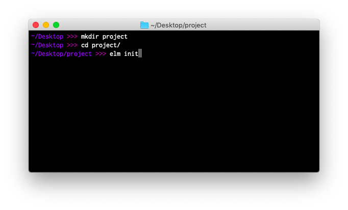

# Install Elm

The previous page described how to install a code editor for Elm, so the next step is to obtain an executable file named `elm`. Here are the **install** links:

- **Mac** - [installer](https://github.com/elm/compiler/releases/download/0.19.1/installer-for-mac.pkg)
- **Linux** - <a href="https://github.com/elm/compiler/blob/master/installers/linux/README.md" target="_blank">instructions</a>
- **Windows** - [installer](https://github.com/elm/compiler/releases/download/0.19.1/installer-for-windows.exe)

After installation is complete, open up the terminal on your computer. It may be called `cmd.exe` or `Command Prompt` on Windows.



Start by navigating to your desktop in the terminal:

```bash
# Mac and Linux
cd ~/Desktop

# Windows (but with <username> filled in with your user name)
cd C:\Users\<username>\Desktop
```

The next step is to get familiar with `elm` command. I personally had a really hard time learning terminal commands, so I worked hard to make the `elm` command nice to use. Let's go through a couple common scenarios.


<br>

## <span style="font-family:Consolas,'Liberation Mono',Menlo,Courier,monospace;">elm init</span>

You can start an Elm project by running:

```bash
elm init
```

Try running this command to create an `elm.json` file and a `src/` directory:

- [`elm.json`](https://github.com/elm/compiler/blob/master/docs/elm.json/application.md) describes your project.
- `src/` holds all of your Elm files.

Now try creating a file called `src/Main.elm` in your editor, and copying in the code from [the buttons example](https://elm-lang.org/examples/buttons).


<br>

## <span style="font-family:Consolas,'Liberation Mono',Menlo,Courier,monospace;">elm reactor</span>

`elm reactor` helps you build Elm projects without messing with the terminal too much. You just run it at the root of your project, like this:

```bash
elm reactor
```

This starts a server at [`http://localhost:8000`](http://localhost:8000). You can navigate to any Elm file and see what it looks like. Run `elm reactor`, follow the localhost link, and try to check out your `src/Main.elm` file!


<br>

## <span style="font-family:Consolas,'Liberation Mono',Menlo,Courier,monospace;">elm make</span>

You can compile Elm code to HTML or JavaScript with commands like this:

```bash
# Create an index.html file that you can open in your browser.
elm make src/Main.elm

# Create an optimized JS file to embed in a custom HTML document.
elm make src/Main.elm --optimize --output=elm.js
```

Try running these commands on your `src/Main.elm` file.

This is the most general way to compile Elm code. It is extremely useful once your project becomes too advanced for `elm reactor`.

This command produces the same messages you have been seeing in the online editor and with `elm reactor`. Years of work has gone into them so far, but please report any unhelpful messages [here](https://github.com/elm/error-message-catalog/issues). I am sure there are ways to improve!


<br>

## <span style="font-family:Consolas,'Liberation Mono',Menlo,Courier,monospace;">elm install</span>

Elm packages all live at [`package.elm-lang.org`](https://package.elm-lang.org/).

Say you look around and decide you need [`elm/http`][http] and [`elm/json`][json] to make some HTTP requests. You can get them set up in your project with the following commands:

```bash
elm install elm/http
elm install elm/json
```

This adds these dependencies into your `elm.json` file, making these packages available in your project. That will let you say `import Http` and use functions like `Http.get` in your programs.

[http]: https://package.elm-lang.org/packages/elm/http/latest
[json]: https://package.elm-lang.org/packages/elm/json/latest


<br>

## Tips and Tricks

**First**, do not worry about remembering all this stuff!

You can always run `elm --help` to get a full outline of what `elm` is capable of.

You can also run commands like `elm make --help` and `elm repl --help` to get hints about a specific command. This is great if you want to check which flags are available and what they do.

**Second**, do not worry if it takes some time to get comfortable with the terminal in general.

I have been using it for over a decade now, and I still cannot remember how to compress files, find all Elm files in a directory, etc. I still look a lot of things up!

* * *

Now that we have our editor set up and `elm` available in the terminal, let's get back to learning Elm!
