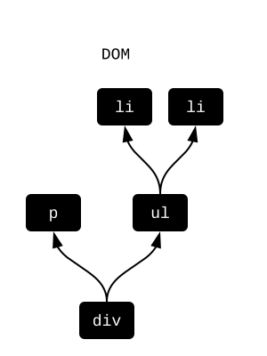
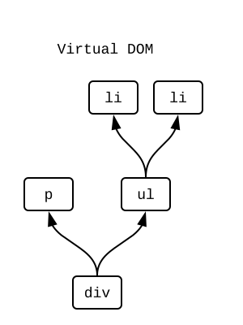
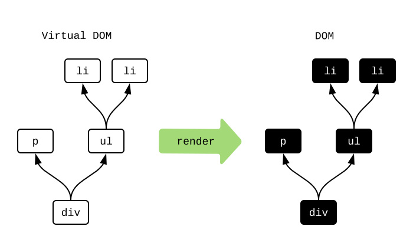
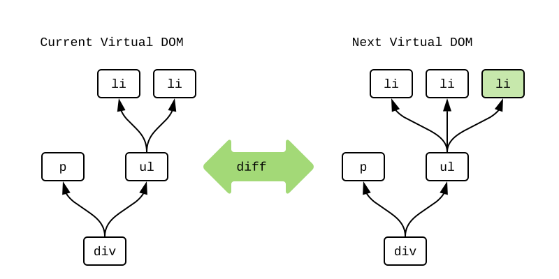
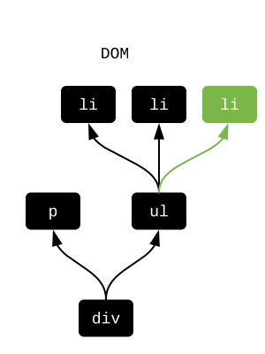
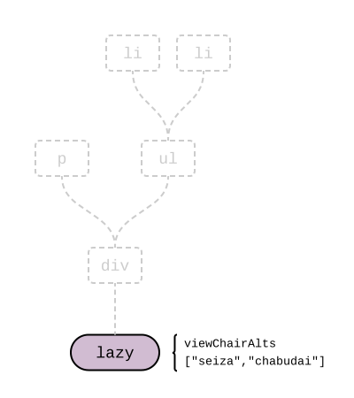

# `Html.Lazy`

In the [`elm/html`](https://package.elm-lang.org/packages/elm/html/latest/) package is used to show things on screen. To understand how to optimize it, we need to learn how it works in the first place!


## What is the DOM?

If you are creating an HTML file, you would write HTML directly like this:

```html
<div>
  <p>Chair alternatives include:</p>
  <ul>
    <li>seiza</li>
    <li>chabudai</li>
  </ul>
</div>
```

You can think of this as producing some DOM data structure behind the scenes:



The black boxes represent heavy-weight DOM objects with hundreds of attributes. And when any of them change, it can trigger expensive renders and reflows of page content.


## What is Virtual DOM?

If you are creating an Elm file, you would use `elm/html` to write something like this:

```elm
viewChairAlts : List String -> Html msg
viewChairAlts chairAlts =
  div []
    [ p [] [ text "Chair alternatives include:" ]
    , ul [] (List.map viewAlt chairAlts)
    ]

viewAlt : String -> Html msg
viewAlt chairAlt =
  li [] [ text chairAlt ]
```

You can think of `viewChairAlts ["seiza","chabudai"]` as producing some “Virtual DOM” data structure behind the scenes:



The white boxes represent light-weight JavaScript objects. They only have the attributes you specify. Their creation can never cause renders or reflows. Point is, compared to DOM nodes, these are much cheaper to allocate!


## Render

If we are always working with these virtual nodes in Elm, how does it get converted to the DOM we see on screen? When an Elm program starts, it goes like this:

- Call `init` to get the initial `Model`.
- Call `view` to get the initial virtual nodes.

Now that we have virtual nodes, we make an exact replica in the real DOM:



Great! But what about when things change? Redoing the whole DOM on every frame does not work, so what do we do instead?


## Diffing

Once we have the initial DOM, we switch to working primarily with virtual nodes instead. Whenever the `Model` changes, we run `view` again. From there, we “diff” the resulting virtual nodes to figure out how to touch the DOM as little as possible.

So imagine our `Model` gets a new chair alternative, and we want to add a new `li` node for it. Behind the scenes, Elm diffs the **current** virtual nodes and the **next** virtual nodes to detect any changes:



It noticed that a third `li` was added. I marked it in green. Elm now knows exactly how to modify the real DOM to make it match. Just insert that new `li`:



This diffing process makes it possible to touch the DOM as little as possible. And if no differences are found, we do not need to touch the DOM at all! So this process helps minimize the renders and reflows that need to happen.

But can we do even less work?


## `Html.Lazy`

The [`Html.Lazy`](https://package.elm-lang.org/packages/elm/html/latest/Html-Lazy/) module makes it possible to not even build the virtual nodes! The core idea is the `lazy` function:

```elm
lazy : (a -> Html msg) -> a -> Html msg
```

Going back to our chair example, we called `viewChairAlts ["seiza","chabudai"]`, but we could just as easily have called `lazy viewChairAlts ["seiza","chabudai"]` instead. The lazy version allocates a single “lazy” node like this:



The node just keeps a reference to the function and arguments. Elm can put the function and arguments together to generate the whole structure if needed, but it is not always needed!

One of the cool things about Elm is the “same input, same output” guarantee for functions. So whenever we run into two “lazy” nodes while diffing virtual nodes, we ask is the function the same? Are the arguments the same? If they are all the same, we know the resulting virtual nodes are the same as well! **So we can skip building the virtual nodes entirely!** If any of them have changed, we can build the virtual nodes and do a normal diff.

> **Note:** When are two values “the same” though? To optimize for performance, we use JavaScript’s `===` operator behind the scenes:
>
> - Structural equality is used for `Int`, `Float`, `String`, `Char`, and `Bool`.
> - Reference equality is used for records, lists, custom types, dictionaries, etc.
>
> Structural equality means that `4` is the same as `4` no matter how you produced those values. Reference equality means the actual pointer in memory has to be the same. Using reference equality is always cheap `O(1)`, even when the data structure has thousands or millions of entries. So this is mostly about making sure that using `lazy` will never slow your code down a bunch by accident. All the checks are super cheap!


## Usage

The ideal place to put a lazy node is at the root of your application. Many applications are set up to have distinct visual regions like headers, sidebars, search results, etc. And when people are messing with one, they are very rarely messing with the others. This creates really natural lines for `lazy` calls!

For example, in [my TodoMVC implementation](https://github.com/evancz/elm-todomvc/), the `view` is defined like this:

```elm
view : Model -> Html Msg
view model =
  div
    [ class "todomvc-wrapper"
    , style "visibility" "hidden"
    ]
    [ section
        [ class "todoapp" ]
        [ lazy viewInput model.field
        , lazy2 viewEntries model.visibility model.entries
        , lazy2 viewControls model.visibility model.entries
        ]
    , infoFooter
    ]
```

Notice that the text input, entries, and controls are all in separate lazy nodes. So I can type however many characters I want in the input without ever building virtual nodes for the entries or controls. They are not changing! So the first tip is **try to use lazy nodes at the root of your application.**

It can also be useful to use lazy in long lists of items. In the TodoMVC app, it is all about adding entries to your todo list. You could conceivable have hundreds of entries, but they change very infrequently. This is a great candidate for laziness! By switching `viewEntry entry` to `lazy viewEntry entry` we can skip a bunch of allocation that is very rarely useful. So the second tip is **try to use lazy nodes on repeated structures where each individual item changes infrequently.**


## Summary

Touching the DOM is way more expensive than anything that happens in a normal user interface. Based on my benchmarking, you can do whatever you want with fancy data structures, but in the end it only matters how much you successfully use `lazy`.

On the next page, we will learn a technique to use `lazy` even more!

