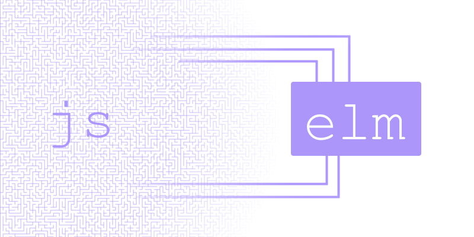

# JavaScript Interop

At some point your Elm program is probably going to need to talk to JavaScript. We do this by (1) embedding Elm in HTML and (2) sending messages back and forth between Elm and JavaScript:



This way we can have access to full power of JavaScript, the good and the bad, without giving up on all the things that are nice about Elm.


## Step 1: Embed in HTML

Normally when you run the Elm compiler, it will give you an HTML file that sets everything up for you. So running this:

```bash
elm-make src/Main.elm
```

Will result in a `index.html` file that you can just open up and start using. To do fancier stuff, we want to compile to JavaScript, so we modify the command slightly:

```bash
elm-make src/Main.elm --output=main.js
```

Now the compiler will generate a JavaScript file that lets you initialize your program like this:

```html
<div id="main"></div>
<script src="main.js"></script>
<script>
    var node = document.getElementById('main');
    var app = Elm.Main.embed(node);
    // Note: if your Elm module is named "MyThing.Root" you
    // would call "Elm.MyThing.Root.embed(node)" instead.
</script>
```

This is doing three important things:

  1. We create a `<div>` that will hold the Elm program.
  2. We load the JavaScript generated by the Elm compiler.
  3. We grab the relevant node and initialize our Elm program in it.

So now we can set Elm up in any `<div>` we want. So if you are using React, you can create a component that just sets this kind of thing up. If you are using Angular or Ember or something else, it should not be too crazy either. Just take over a `<div>`.

The next section gets into how to get your Elm and JavaScript code to communicate with each other in a nice way.


## Step 2: Talk to JavaScript

There are two major ways for Elm and JavaScript to talk to each other: **ports** and **flags**.


### Ports

Say we have a nice Elm program and everything is going fine, but we want to use some JavaScript spell-checking library to get a feature done real quick. The final result is shown [here][spelling], and we will walk through the most important parts here.

[spelling]: https://gist.github.com/evancz/e69723b23958e69b63d5b5502b0edf90

Okay, in Elm, **any communication with JavaScript goes through a port**. Think of it like a hole in the side of your Elm program where you can send values in and out. These work exactly like the commands and subscriptions from [the Architecture section](/architecture). Sending values out to JS is a command. Listening for values coming in from JS is a subscription. Pretty neat!

So if we want to talk to this spell-checking library, our Elm program will need these additional declarations:

```elm
port module Spelling exposing (..)

...

-- port for sending strings out to JavaScript
port check : String -> Cmd msg

-- port for listening for suggestions from JavaScript
port suggestions : (List String -> msg) -> Sub msg

...
```

Again, you can see the whole file [here][spelling], but these are the important additions:

  1. We change the `module` declaration to `port module`. This indicates that `port` declarations should be permitted. (Very few modules should have ports in them!)

  2. We create a `check` port. On the Elm side, we can create commands like `check "badger"`, resulting in a `Cmd msg` that sends strings to the JS side.

  3. We create a `suggestions` port. This one looks a bit fancier than the `check` port, but imagine that it is creating `Sub (List String)`. You are essentially subscribing to lists of strings sent into Elm from JS. So when the spell-checking library has a suggestion, it will send things through. Now, the type of `suggestions` is a bit fancier than that. You provide a function from `(List String -> msg)` so you can convert that list of strings to your `Msg` type immediately. This makes it easy to deal with in your `update` function, but it is just for convenience. The real point is to send a `List String` from JS into Elm.

Okay, so after you run `elm-make Spelling.elm --output=spelling.js` you embed it in HTML like this:

```html
<div id="spelling"></div>
<script src="spelling.js"></script>
<script>
    var app = Elm.Spelling.fullscreen();

    app.ports.check.subscribe(function(word) {
        var suggestions = spellCheck(word);
        app.ports.suggestions.send(suggestions);
    });

    function spellCheck(word) {
        // have a real implementation!
        return [];
    }
</script>
```

Okay, so all the ports you declare in your Elm program will be available as fields of `app.ports`. In the code above, we access `app.ports.check` and `app.ports.suggestions`. They work like this:

  - We can subscribe to `app.ports.check`. Every time Elm says to send a value out, we will call this JavaScript function.

  - We can send values to `app.ports.suggestions`. So whenever we have some new suggestions for Elm, we just `send` them through.

With that knowledge, we can communicate back and forth with JavaScript!

> **Note:** Elm validates all values coming in from JavaScript. In Elm we said we can only handle `List String` so we need to make sure that the JavaScript code does not break that contract! More about that [farther down this page](#customs-and-border-protection).


### Flags

The second way to talk to JavaScript is with *flags*. You can think of this as some static configuration for your Elm program.

Instead of creating a `Program` with the [`program`][program] function, we can use the [`programWithFlags`][programWithFlags]. So say we want to get a value like this from JavaScript on initialization:

[program]: http://package.elm-lang.org/packages/elm-lang/html/latest/Html#program
[programWithFlags]: http://package.elm-lang.org/packages/elm-lang/html/latest/Html#programWithFlags

```elm
type alias Flags =
  { user : String
  , token : String
  }
```

We would set up our Elm program like this:

```elm
init : Flags -> ( Model, Cmd Msg )
init flags =
  ...

main =
  programWithFlags { init = init, ... }
```

And on the JavaScript side, we start the program like this:

```javascript
// if you want it to be fullscreen
var app = Elm.MyApp.fullscreen({
    user: 'Tom',
    token: '12345'
});

// if you want to embed your app
var node = document.getElementById('my-app');
var app = Elm.MyApp.embed(node, {
    user: 'Tom',
    token: '12345'
});
```

Notice that this is exactly the same as normal, but we provide an extra argument with all the flags we want.

Just like ports, the values sent in from JavaScript are validated to make sure JavaScript bugs stay in JavaScript.


## Customs and Border Protection

Ports and flags must be careful about what values are allowed through. Elm is statically typed, so each port is fitted with some border protection code that ensures that type errors are kept out. Ports also do some conversions so that you get nice colloquial data structures in both Elm and JS.

The particular types that can be sent in and out of ports are quite flexible, covering [all valid JSON values](http://www.json.org/). Specifically, incoming ports can handle all the following Elm types:

  * **Booleans and Strings** &ndash; both exist in Elm and JS!
  * **Numbers** &ndash; Elm ints and floats correspond to JS numbers
  * **Lists**   &ndash; correspond to JS arrays
  * **Arrays**  &ndash; correspond to JS arrays
  * **Tuples**  &ndash; correspond to fixed-length, mixed-type JS arrays
  * **Records** &ndash; correspond to JavaScript objects
  * **Maybes**  &ndash; `Nothing` and `Just 42` correspond to `null` and `42` in JS
  * **Json**    &ndash; [`Json.Encode.Value`](http://package.elm-lang.org/packages/elm-lang/core/latest/Json-Encode#Value) corresponds to arbitrary JSON

Now say Elm wants a `List String`, but someone calls `app.ports.suggestions.send(42)` on the JavaScript side. We *know* it will cause issues in Elm, and we *know* the code producing invalid data is on the JS side. So rather than letting the bad data into Elm and cause a runtime exception *eventually* (the JavaScript way!) we throw a runtime exception *immediately* when you call `send` with invalid data. So we cannot solve the problem of invalid data in JavaScript, but we can at least make sure it stays on the JavaScript side!


## Usage Advice

I showed an example where the ports were declared in the root module. This is not a strict requirement. You can actually create a `port module` that gets imported by various parts of your app.

It seems like it is probably best to just have one `port module` for your project so it is easier to figure out the API on the JavaScript side. I plan to improve tooling such that you can just ask though.

> **Note:** Port modules are not permitted in the package repository. Imagine you download an Elm package and it just doesn't work. You read the docs and discover you *also* need to get some JS code and hook it up properly. Lame. Bad experience. Now imagine if you had this risk with *every* package out there. It just would feel crappy, so we do not allow that.


## Historical Context

Now I know that this is not the typical interpretation of *language interop*. Usually languages just go for full backwards compatibility. So C code can be used *anywhere* in C++ code. You can replace C/C++ with Java/Scala or JavaScript/TypeScript. This is the easiest solution, but it forces you to make quite extreme sacrifices in the new language. All the problems of the old language now exist in the new one too. Hopefully less though.

Elm's interop is built on the observation that **by enforcing some architectural rules, you can make full use of the old language *without* making sacrifices in the new one.** This means we can keep making guarantees like "you will not see runtime errors in Elm" even as you start introducing whatever crazy JavaScript code you need.

So what are these architectural rules? Turns out it is just The Elm Architecture. Instead of embedding arbitrary JS code right in the middle of Elm, we use commands and subscriptions to send messages to external JavaScript code. So just like how the `WebSocket` library insulates you from all the crazy failures that might happen with web sockets, port modules insulate you from all the crazy failures that might happen in JavaScript. **It is like JavaScript-as-a-Service.**
